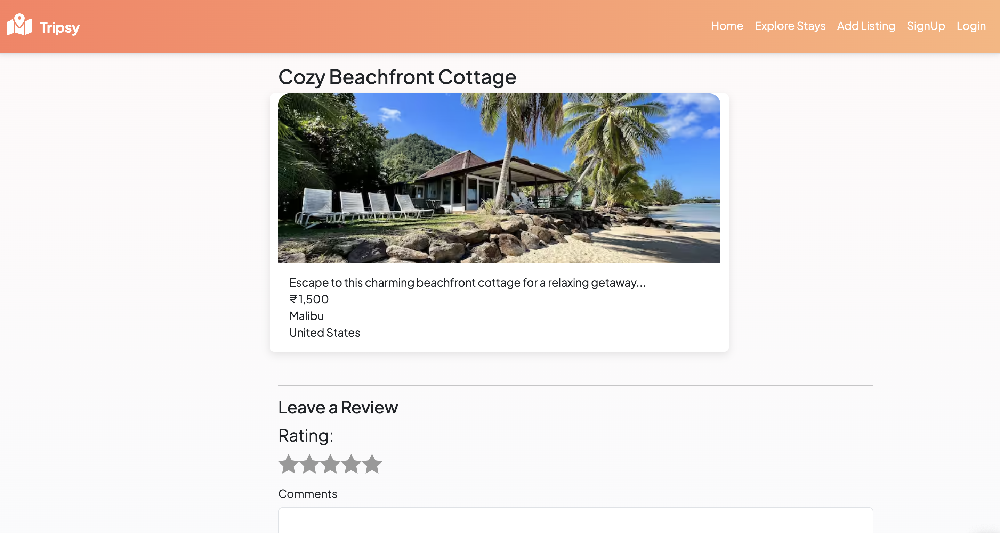
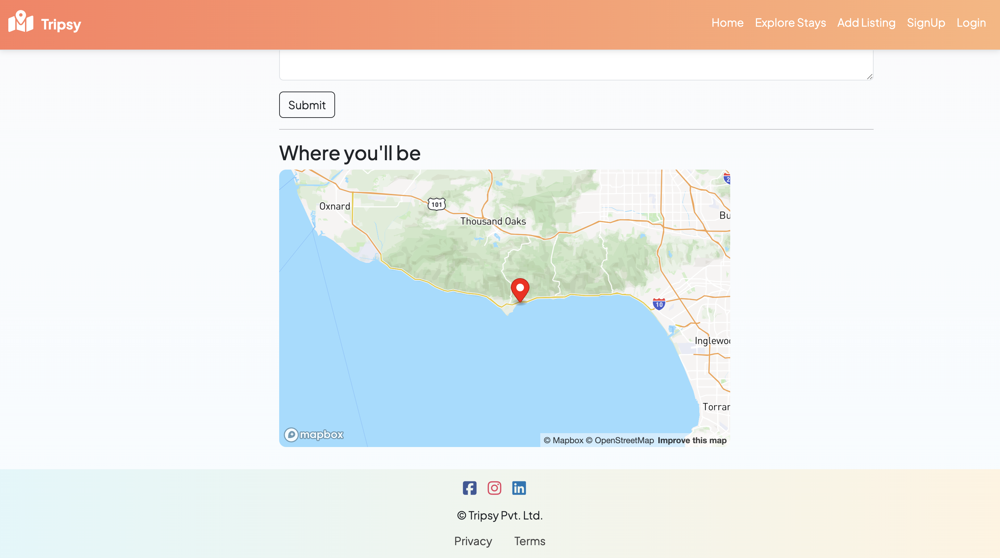
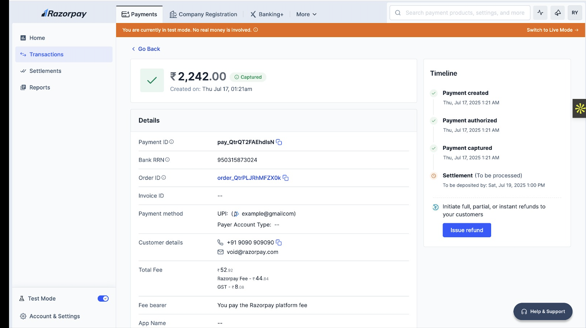

# 🌍 Tripsy — Full Stack Travel Listing Platform

## 📝 Project Description

Tripsy is a full-stack travel listing platform where users can:

- Discover unique travel destinations with maps, images, and reviews  
- Add and manage their own listings  
- Leave reviews for places they’ve visited  
- Make payments for listings using Razorpay  
- View listing locations on interactive Mapbox maps  

The goal is to help users explore and share travel experiences — all in one beautiful, functional app.

---

## 🔹 Features

- User Registration and Login  
- Add, Update, Delete Travel Listings  
- Upload Images with Cloudinary  
- Leave Reviews  
- Payment Integration with Razorpay  
- Map integration using Mapbox  
- Responsive UI with EJS templating

---

## ⚙ Tech Stack

**Frontend:**
- EJS (Embedded JavaScript Templates)
- Bootstrap
- Cloudinary (for image hosting)
- Mapbox (for interactive maps)

**Backend:**
- Node.js + Express.js (API & server)
- MongoDB + Mongoose (Database)
- Razorpay (for payments)
- Passport.js (authentication)
- Multer (file handling)
- Dotenv, Cookie-Parser

---

## 🖥️ Refer for pictures

```




```

---

## 🔹 Installation

```bash
git clone https://github.com/donna1356/Tripsy.git
cd Tripsy
npm install
```

---

## ▶️ Running the Project

```bash
node app.js
```

Runs at: `http://localhost:8080`

---

## Razorpay Payment (Sandbox)

1. Get your Razorpay test keys from [dashboard.razorpay.com](https://dashboard.razorpay.com/)
2. Add them to your `.env` file:
   ```
   RAZORPAY_KEY_ID=your_key_id
   RAZORPAY_SECRET=your_secret
   ```
3. Use `/payment/create-order` route to create a payment order
4. Razorpay Checkout is used on the frontend to complete payments

---

## Mapbox Integration

1. Create a Mapbox account at [mapbox.com](https://www.mapbox.com/)
2. Get your access token and add to `.env`:
   ```
   MAPBOX_TOKEN=your_mapbox_token
   ```
3. The map renders dynamically for each listing on its detail page

---

## Author

Dona Banerjee — [@donna1356](https://github.com/donna1356)

---

Feel free to contribute, suggest features, or report issues!
